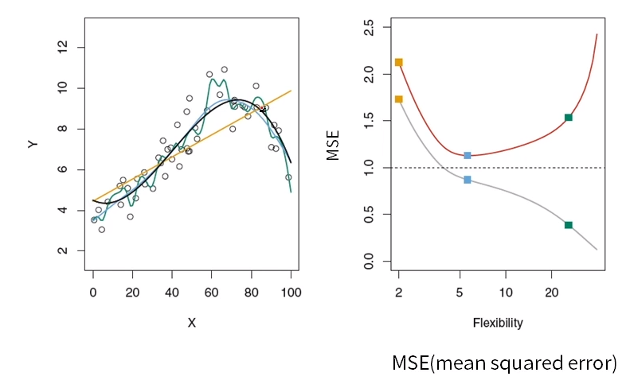

# 5. ML의 개념과 종류

## 1. 머신러닝의 개념

> X로 Y를 예측하고 싶다.

- 기계 학습 또는 머신 러닝은 인공지능의 한 분야로, 컴퓨터가 학습할 수 있도록 하는 알고리즘과 기술을 개발하는 분야를 말한다.
- 주어진 데이터를 통해 입력변수와 출력변수간의 관계를 만드는 함수 f를 만드는 것
- 주어진 데이터 속에서 데이터의 특징을 찾아내는 함수 f를 만드는 것

- 예시

  - 고객들의 개인 정보 및 금융 관련 정보 → 대출 연체자 예측 탐지 모델, 대출 연체 관련 주요 feature 추출
  - 게임 유저들의 게임 내 활동정보 → 게임 이탈 여부/어뷰징 여부 → 이상 탐지 모델
  - 숫자 손글씨 데이터 → 숫자 라벨(0~9) → 숫자 이미지 분류 모델
  - 상품 구매 고객 특성 정보 → 군집화를 통한 고객 특성에 따른 segmentation
  - 고객들의 상품 구매 내역 → 매장 내 상품 진열 위치 리뉴얼을 통한 매출 증대
  - 쇼핑몰 페이지 검색 및 클릭 로그 기록 → 맞춤 상품 추천 시스템
  - SNS 데이터 및 뉴스 데이터 → 소셜 및 사회 이슈 파악

- f란 무엇인가(회귀 분석)

  - f를 구하기 위해 입력 변수와 출력 변수가 필요

  - p개의 입력변수가 있고, 출력변수 Y가 있을 때 입력 변수와 출력 변수의 관계를 나타내는 식
    $$
    Y = f(X) + e
    $$
    
    - f 정해졌지만 알 수 없는 함수
    - e 오차

## 2. 지도학습과 비지도학습

### 지도학습(supervised learning)

- Y = f(X)에 대해서 입력 변수(X)와 출력 변수(Y)의 관계에 대해서 모델링하는 것 (Y에 대해 예측 또는 분류하는 문제)
- **회귀(regression)**: 입력 변수 x에 대해서 연속형 출력 변수  Y를 예측
- **분류(classification)**: 입력 변수 x에 대해서 이산형 출력 변수 Y(class)를 예측

### 비지도학습(unsupervised learning)

- 출력 변수(Y)가 존재하지 않고, 입력 변수(X)간의 관계에 대해 모델링 하는 것
- 군집 분석: 유사한 데이터끼리 그룹화
- PCA: 독립변수들의 차원을 축소화

**지도학습과 비지도학습의 차이점: labeled-data의 유무**

### 강화학습(reinforcement learning)

- 수많은 시뮬레이션을 통해 현재의 선택이 먼 미래에 보상이 최대가 되도록 학습
- Agent가 action을 취하고 환겨에서 보상을 받고 이 보상이 최대가 되도록 최적의 action을 취하는 방법을 배움 

## 머신러닝의 종류

### 선형 회귀분석(Linear Regression)

- 독립변수와 종속변수가 선형적인 관계에 있다라는 가정하에 분석
- 직선을 통해 종속변수를 예측하기 때문에 독립변수의 중요도와 영향력을 파악하기 쉬움

### 의사결정나무(Decision Tree)

- 독립 변수의 조건에 따라 종속변수를 분리(비가 내린다 → 축구를 하지 않는다)
- 이해하기 쉬우나 overfitting이 잘 일어남
  - overfitting: 과적합, 학습 데이터에 너무 잘 맞아서 실제 데이터에는 잘 맞지 않음

- 앙상블러닝에서 많이 사용

### KNN(K-Nearest Neighbor)

- 새로 들어온 데이터의 주변 k개의 데이터의 class로 분류하는 기법

### Neural Network

- 입력, 은닉, 출력층으로 구성된 모형으로서 각 층을 연결하는 노드의 가중치를 업데이트하면서 학습
- overfitting

### SVM(Support Vector Machine)

- Class간의 거리(margin)가 최대가 되도록 decision boundary를 만드는 방법
- 학습 과정 내에서 어느정도의 오차를 허용, decision boundary가 좋아짐
- 학습에 너무 오랜 시간, 데이터가 커질수록 심각

### Ensemble Learning :star:

- 여러 개의 모델(classifier or base learner)을 결합하여 사용하는 모델
- 알고리즘의 정확도 높음
- Y에 영향을 미치는 어떤 파라미터를 찾는 게 목적이라면 앙상블 러닝은 좋은 선택지가 아님

### K-means clustering

- Label없이 데이터의 군집으로 k개 생성
- 고차원 데이터에서 잘 안맞는 경향

## 3. 딥러닝 주요 모델

### Neural Network

- 입력, 은닉 , 출력층으로 구성된 모형으로서 각 층을 연결하는 노드의 가중치를 업데이트하면서 학습
- overfitting, 긴 학습시간

### Deep Learning

- 다층의 layer를 통해 복잡한 데이터의 학습이 가능토록 함(graphical representation learning)

- 알고리즘 및 GPU의 발전이 deep learning의 부흥을 이끔

- 이미지 분류에서 기존 모델

  - 각각의 픽셀 값(늘어뜨려서)을 독립변수로 사용

  - 독립변수들은 각각 독립이라는 기본적인 가정에서 어긋남

  - 다양한 형태로 발전(CNN, RNN, AutoEncoder)

    - ### CNN (Convolutional Neural Network)

      - 이미지의 지역별 feature를 뽑아서 neural network 학습
      - 다양한 분야로 발전: Object detection, Image resolution, style transfer, colorization

- 네트워크 초기화 기법(Xavier, he initialization 등)

- 다양한 activation function(ReLu, ELU, SeLU, Leaky ReLU 등)

- Generalization, overfitting에 관한 문제

- Semi-supervised learning , Unsupervised learning

### GAN(Generative Adversarial Network)

- Data를 만들어내는 **Generator**와 만들어진 data를 평가하는 **Discriminator**가 서로 대립(**Adversairal**)적으로 학습해가며 성능을 점차 개선해 나가자는 개념

### 강화학습(Reinforcemetn Learning)

- Q-learning: 현재 상태에서부터 먼 미래까지 가장 큰 보상을 얻을 수 있는 행동을 학습하게 하는 것
- Q-learning + Deep Learning: DQN(Deep Reinforcement Learning)
  - 더 효율적으로 빠르게 학습할 수 있는 강화학습 모델
  - Action이 continuous한 경우
  - Reward가 매우 sparse(희박)한 경우
  - Multi agent 강화학습 모델

> 머신러닝을 기반으로 딥러닝이 발전했기 때문에, 머신러닝을 알아야 딥러닝을 이해할 수 있다.

## 4. 모형의 적합성 평가 및 실험설계

### 모형의 적합성을 평가하는 방법

- 모형의 복잡도에 따른 학습 집합의 MSE(회색)와 검증 집합의 MSE(빨간색)의 변화는 그림과 같음
- 학습 집합의 MSE는 복잡한 모형일수록 감소하지만, 학습데이터가 아닌 또 다른 데이터(검증 데이터)의 MSE는 일정 시점 이후로 증가
- 증가하는 원인은 왼쪽 그림과 같이 모형이 학습 집합에 과적합되기 때문

		- 검은색: 실제 f를 나타내는 모형
		- 노란색: 가장 낮은 복잡도를 가지므로 **편파성이 높아져** 가장 높은 MSE값을 가짐
		- 초록색: 가장 높은 복잡도를 가지므로 학습 집합에 과적합되어 **분산이 높아짐**. 따라서 검증 데이터의 MSE가 하늘색에 비해 상승함
		- 하늘색: 검은색 모형과 가장 유사한 형태로, **분산과 편파성이 모두 적절히 낮아져** 검증 데이터의 MSE가 가장 낮음	

### 모형의 적합성 평가 및 실험 설계

1. 데이터 분할
   - 과적합을 방지하기 위해 전체 데이터를 학습 데이터, 검증 데이터, 테스트 데이터로 나누며 보통 비율은 5:3:2로 정함
     - 학습 데이터(training data): 모형 f를 추정하는데 필요
     - 검증 데이터(validation data): 추정한 모형 f가 적합한지 검증함
     - 테스트 데이터(test data): 최종적으로 선택한 모형의 성능을 평가
2. 모형 학습: 학습 데이터를 사용하여 각 모형을 학습함
3. 모형 선택: 검증 데이터를 사용하여 각 모형의 성능을 비교하여 모형 선택 (MSE가 낮을수록 좋다)
4. 최종 성능 지표 도출
   - 테스트 데이터를 사용하여 검증 데이터로 도출한 최종 모델의 성능 지표를 계산
   - 데이터를 어떻게 분류하느냐에 따라 성능에 영향이 달라지며, 이는 최종 모형 선택에 영향을 끼칠 수 있음(k-fold cross validation)

### K-Fold 교차검증(K-Fold Cross Validation)

- 모형의 적합성을 보다 객관적으로 평가하기 위한 방법
- 데이터를 k(주로 5 또는 10)개 부분으로 나눈 뒤, 그 중 하나를 검증 집합, 나머지를 학습 집합으로 분류
- 위 과정을 k번 반복하고 k개의 성능 지표를 **평균**하여 모형의 적합성을 평가

### LOOCV(Leave-One-Out Cross Validation)

- 데이터 수가 적을 때 사용하는 교차검증 방법
- 총 n(데이터 수 만큼)개의 모델을 만드는데, 각 모델은 하나의 샘플만 제외하면서 모델을 만들고 제외한 샘플로 성능 지표를 계산함. 이렇게 도출한 n개의 성능 지표를 평균 내 최종 성능 지표를 도출

### 모형의 적합성 평가 및 실험 설계

- 데이터 분석 과정: raw데이터 → 전처리 된 데이터 → 실험 설계 → 모델
- 전처리
  - raw데이터를 모델링할 수 있도록 데이터를 병합 및 파생 변수 생성
- 실험 설계
  - 실험설계에서 test데이터는 실제로 우리가 모델을 적용한다고 가정해야 함
  - **Train, validation 데이터에 test 정보는 없어야 함**

## 5. 과적합(Overfitting)

- 과적합
  - 복잡한 모형일수록, 데이터가 적을수록 과적합이 일어나기 쉬움
  - 과적합은 AI전반적으로 매우 큰 이슈
- 분산(Variance)과 편파성(Bias)의 트레이드오프(Tradeoff)
  - 모형 f^(X)로 모집단의 전체 데이터를 예측할 대 발생하는 총 error를 계산하면 reducible error과 irreducible error로 표현되며, reducible error는 다시 분산과 편파성으로 구성
    - 분산: 전체 데이터 집합 중 다른 학습 데이터를 애용했을 때, f^이 변하는 정도(복잡한 모형일수록 분산이 높음)
    - 편파성: 학습 알고리즘에서 잘못된 가정을 했을 때 발새하는 오차(간단한 모형일수록 편파성이 높음)
    - 복잡한 모형: f^(X)을 사용하여 편파성을 줄이면, 반대로 분산이 커짐(간단한 모형일 경우 반대의 현상이 발생)
    - 따라서 분산과 편파성이 작은 모형을 찾아야 함
  - 적절한 모형 선택과 실험 설계를 통한 과적합 방지